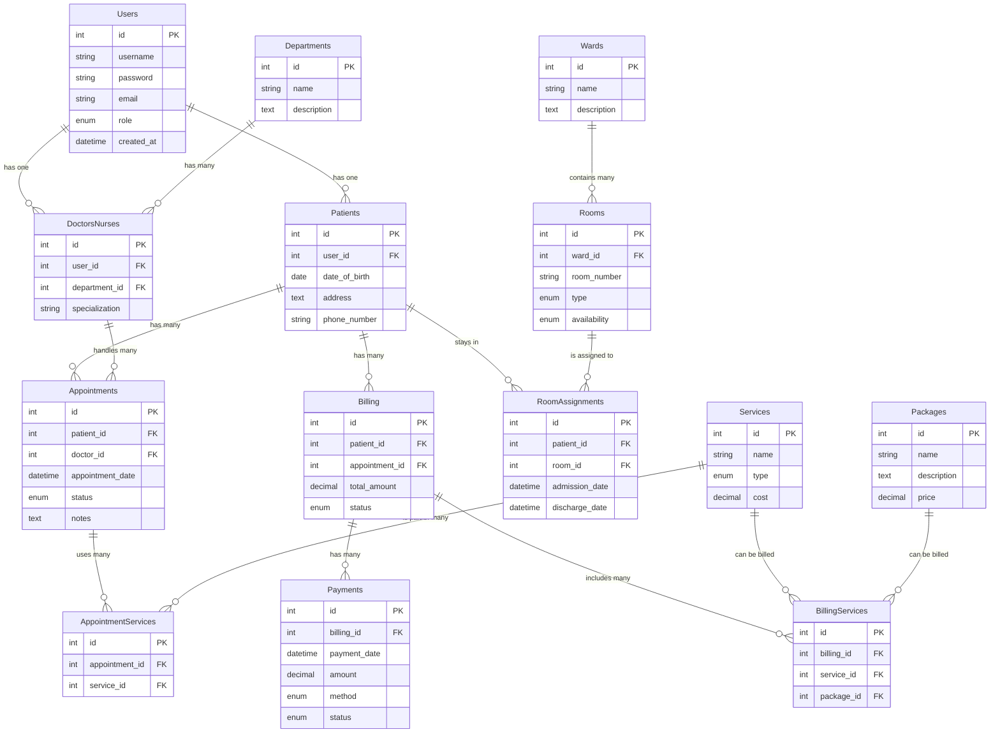
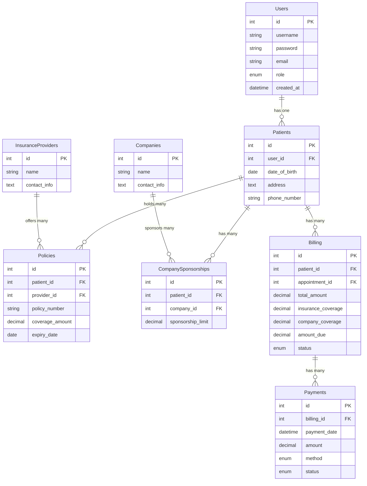

#Building HMS System using ReactJS for frontend and Node & Express for backend.

## **System Requirements and Functionalities**

1. **User Management**
   - User Types: Admin, Doctor, Nurse, Receptionist, Patient
   - User Registration/Login (with password hashing and salting)
   - Role-Based Access Control (RBAC)
2. **Patient Management**
   - Patient Registration
   - Patient Profile Management (view, edit, delete)
   - Appointment Scheduling
   - Medical History Recording
3. **Doctor/Nurse Management**
   - Staff Profile Management (view, edit, delete)
   - Schedule Management (availability, appointments)
   - Assignment to Departments/Wards
4. **Appointment Management**
   - Booking/Cancellation of Appointments
   - Reminder Notifications (optional: email/SMS integration)
5. **Billing and Insurance**
   - Invoice Generation
   - Payment Tracking
   - Insurance Provider Integration (optional)
6. **Reports and Analytics**
   - Patient Admission/Discharge Statistics
   - Doctor/Nurse Workload Analysis
   - Billing and Revenue Reports
7. **Other**

   - Department/Ward Management
   - Equipment/Resource Management (optional)

   ## **Database Design (MySQL)**

   ### 1. **Users Table**

   | Column Name | Data Type | Description | | --- | --- | --- | | `id` | `int` (PK, AI) | Unique User ID | | `username` | `varchar(50)` | Username for Login | | `password` | `varchar(255)` | Hashed Password | | `email` | `varchar(100)` | User Email | | `role` | `enum('admin', 'doctor', 'nurse', 'receptionist', 'patient')` | User Role | | `created_at` | `timestamp` | Registration Timestamp |

   ### 2. **Patients Table**

   | Column Name | Data Type | Description | | --- | --- | --- | | `id` | `int` (PK, AI) | Unique Patient ID | | `user_id` | `int` (FK to Users.id) | Associated User ID | | `name` | `varchar(100)` | Patient Full Name | | `date_of_birth` | `date` | Patient's Date of Birth | | `contact_number` | `varchar(20)` | Patient's Contact Number | | `address` | `text` | Patient's Address | | `medical_history` | `text` | Patient's Medical History |

   ### 3. **Doctors/Nurses Table**

   | Column Name | Data Type | Description | | --- | --- | --- | | `id` | `int` (PK, AI) | Unique Staff ID | | `user_id` | `int` (FK to Users.id) | Associated User ID | | `name` | `varchar(100)` | Staff Full Name | | `specialization` | `varchar(100)` | Doctor's Specialization or Nurse's Specialty | | `department_id` | `int` (FK to Departments.id) | Assigned Department |

   ### 4. **Departments Table**

   | Column Name | Data Type | Description | | --- | --- | --- | | `id` | `int` (PK, AI) | Unique Department ID | | `name` | `varchar(100)` | Department Name | | `description` | `text` | Department Description |

   ### 5. **Appointments Table**

   | Column Name | Data Type | Description | | --- | --- | --- | | `id` | `int` (PK, AI) | Unique Appointment ID | | `patient_id` | `int` (FK to Patients.id) | Associated Patient ID | | `doctor_id` | `int` (FK to Doctors/Nurses.id) | Associated Doctor ID | | `appointment_date` | `datetime` | Scheduled Appointment Date & Time | | `status` | `enum('pending', 'attended', 'cancelled')` | Appointment Status |

   ### 6. **Billing Table**

   | Column Name | Data Type | Description | | --- | --- | --- | | `id` | `int` (PK, AI) | Unique Billing ID | | `patient_id` | `int` (FK to Patients.id) | Associated Patient ID | | `appointment_id` | `int` (FK to Appointments.id) | Associated Appointment ID | | `invoice_date` | `date` | Invoice Generation Date | | `amount` | `decimal(10, 2)` | Total Amount | | `payment_status` | `enum('pending', 'paid')` | Payment Status |

   ### Additional Tables (if required for additional functionalities)

   - -

   continue

   Here's the continuation of the planning and database design for your Hospital Management System (HMS):

   **Additional Tables (if required for additional functionalities)**

   ### 7. **Insurance Providers Table** (if integrating with insurance)

   | Column Name       | Data Type      | Description                    |
   | ----------------- | -------------- | ------------------------------ |
   | `id`              | `int`(PK, AI)  | Unique Insurance Provider ID   |
   | `name`            | `varchar(100)` | Insurance Provider Name        |
   | `contact_details` | `text`         | Provider's Contact Information |

   ### 8. **Payments Table** (for detailed payment tracking)

   | Column Name | Data Type | Description | | --- | --- | --- | | `id` | `int` (PK, AI) | Unique Payment ID | | `billing_id` | `int` (FK to Billing.id) | Associated Billing ID | | `payment_method` | `enum('cash', 'card', 'insurance')` | Payment Method | | `payment_date` | `date` | Payment Date | | `amount_paid` | `decimal(10, 2)` | Amount Paid |

   ```markdown
   | Column Name | Data Type | Description | | --- | --- | --- | | id | int (PK, AI) | Unique Payment ID | | billing_id | int (FK to Billing.id) | Associated Billing ID | | payment_method | enum('cash', 'card', 'insurance') | Payment Method | | payment_date | date | Payment Date | | amount_paid | decimal(10, 2) | Amount Paid |
   ```

   ### 9. **Reports and Analytics Tables** (optional, for summarized data)

   - **Admissions Table**: Tracks admission and discharge dates for analytics.
   - **Workload Table**: Summarizes appointments per doctor/nurse for workload analysis.

### **Database Schema Visualization**

```
+---------------+
|     Users    |
+---------------+
|  id (PK)     |
|  username    |
|  password    |
|  email       |
|  role        |
|  created_at  |
+---------------+
       |
       |  (One-To-One)
       v
+---------------+       +---------------+
|   Patients   |       |  Doctors/Nurses  |
+---------------+       +---------------+
|  id (PK)     |       |  id (PK)       |
|  user_id (FK)|       |  user_id (FK)  |
|  ...         |       |  ...          |
+---------------+       +---------------+
       |                         |
       |  (Many-To-One)          |  (Many-To-One)
       v                         v
+---------------+       +---------------+
|  Appointments |       |   Departments  |
+---------------+       +---------------+
|  id (PK)     |       |  id (PK)      |
|  patient_id  |       |  name         |
|  doctor_id   |       |  description  |
|  ...         |       +---------------+
+---------------+
       |
       |  (One-To-Many)
       v
+---------------+
|     Billing  |
+---------------+
|  id (PK)     |
|  patient_id  |
|  appointment_id|
|  ...         |
+---------------+
       |
       |  (One-To-Many)
       v
+---------------+
|    Payments  |
+---------------+
|  id (PK)     |
|  billing_id  |
|  ...         |
+---------------+

```





- Images
  
  

<aside>

https://github.com/maryumurooj/HMS

</aside>

## Tree (Updating as i go)

```markdown
C:.
│ .env
│ index.js
│ package-lock.json
│ package.json
│
├───config
│ config.json
│ database.js
│
├───controllers
│ PatientController.js
│ UserController.js
│
├───middleware
│ authMiddleware.js
│
├───migrations
│ 20241202054539-create-users-table.js
│ 20241202090538-create-users-table.js
│ 20241202090921-create-patients-table.js
│
├───models
│ index.js
│ Patient.js
│ User.js
│
├───routes
│ patient.js
│ user.js
│
├───seeders
└───validators
PatientValidator.js
UserValidator.js
```

```markdown
C:.
│ .gitignore
│ eslint.config.js
│ index.html
│ package-lock.json
│ package.json
│ README.md
│ vite.config.js
│
├───public
│ vite.svg
│
└───src
│ App.css
│ App.jsx
│ index.css
│ main.jsx
│
├───assets
│ react.svg
│
├───components
│ │ Drawer.jsx
│ │ Drawer.module.css
│ │ dynamicForm.jsx
│ │ dynamicForm.module.css
│ │ Header.jsx
│ │ YasirdynamicForm.jsx
│ │ YasirdynamicForm.module.css
│ │
│ ├───MasterDoctor
│ │ doctorMaster.jsx
│ │ doctorRegistrationSchema.json
│ │
│ └───Registration
│ formSchema.json
│ Registration.jsx
│
├───layouts
│ DashboardLayout.jsx
│
├───pages
│ │ Dashboard.jsx
│ │
│ ├───masters
│ │ │ DepartmentMaster.jsx
│ │ │ Master.module.css
│ │ │
│ │ ├───MasterDepartment
│ │ │ departmentMaster.jsx
│ │ │ departmentMasterSchema.json
│ │ │
│ │ ├───MasterDoctor
│ │ │ doctorMaster.jsx
│ │ │ doctorRegistrationSchema.json
│ │ │
│ │ ├───MasterPackage
│ │ │ MasterPackage.json
│ │ │ masterPackage.jsx
│ │ │
│ │ └───MasterWard
│ │ MasterWard.json
│ │ wardMaster.jsx
│ │
│ └───transactions
│ └───Registration
│ Registration.jsx
│ RegistrationSchema.json
│
└───routes
AppRoutes.jsx
```

## Things to remember

- **Migration Process**

  - Run `1st Command` and Create a Migrations Folder
  - Create Model in Models Directory
  - run the `2nd Command` to add a migration to the system
  - Add the relavent code for migration (making of table or updateing value) using the model struture from models
  - Run the `Last Command` to excute the migrations

  ```powershell
  npx sequelize init

  npx sequelize-cli migration:generate --name create-<name>-table

  npx sequelize db:migrate
  ```

- **Use Thunder Client for testing APIs**
  **GET Request:**
  1. **Create a New Request:** Click the "New Request" button or press `Ctrl+N`.
  2. **Set the Method:** Select "GET" from the dropdown menu.
  3. **Enter the Request URL:** Input the API endpoint you want to test.
  4. **Add Headers (Optional):** If the API requires authentication or specific content types, add headers like `Authorization`, `Content-Type`, etc.
  5. **Send the Request:** Click the "Send" button or press `Ctrl+Enter`.
  6. **Inspect the Response:**
     - **Status Code:** Check if the status code is 200 (OK) or another expected code.
     - **Response Body:** Examine the returned data to ensure it's correct and formatted as expected.
     - **Response Headers:** Verify any relevant headers, such as `Content-Type` or `Set-Cookie`.
       **POST Request:**
  7. **Create a New Request:** Follow step 1 for a GET request.
  8. **Set the Method:** Select "POST" from the dropdown menu.
  9. **Enter the Request URL:** Input the API endpoint for creating new resources.
  10. **Add Headers (Optional):** Add headers like `Content-Type: application/json` if you're sending JSON data.
  11. **Set the Request Body:**
      - **Form Data:** Use the "Form Data" tab to add key-value pairs.
      - **JSON:** Use the "JSON" tab to input JSON data.
      - **Raw:** Use the "Raw" tab for custom data formats.
  12. **Send the Request:** Click the "Send" button.
  13. **Inspect the Response:**
      - **Status Code:** Check if the status code is 201 (Created) or another expected code.
      - **Response Body:** Verify the newly created resource's ID or other relevant information.
        **PUT Request:**
  14. **Create a New Request:** Follow step 1 for a GET request.
  15. **Set the Method:** Select "PUT" from the dropdown menu.
  16. **Enter the Request URL:** Input the API endpoint for updating an existing resource.
  17. **Add Headers (Optional):** Add headers like `Content-Type: application/json` if you're sending JSON data.
  18. **Set the Request Body:** Input the updated data in the desired format (JSON, form data, etc.).
  19. **Send the Request:** Click the "Send" button.
  20. **Inspect the Response:**
      - **Status Code:** Check if the status code is 200 (OK) or another expected code.
      - **Response Body:** Verify the updated resource's details.
        **DELETE Request:**
  21. **Create a New Request:** Follow step 1 for a GET request.
  22. **Set the Method:** Select "DELETE" from the dropdown menu.
  23. **Enter the Request URL:** Input the API endpoint for deleting a specific resource.
  24. **Add Headers (Optional):** Add any required headers.
  25. **Send the Request:** Click the "Send" button.
  26. **Inspect the Response:**
      - **Status Code:** Check if the status code is 204 (No Content) or another expected code indicating successful deletion.
        **Additional Tips:**
  - **Environment Variables:** Use environment variables to store sensitive information like API keys or tokens.
  - **Test Suites:** Create test suites to organize and automate your tests.
  - **Assertions:** Use Thunder Client's built-in assertion capabilities to verify expected responses.
  - **Collaboration:** Share collections with your team members to facilitate collaboration.
  - **Automation:** Integrate Thunder Client with CI/CD pipelines for automated testing.
    By following these steps and leveraging Thunder Client's features, you can effectively test various HTTP request types and ensure the quality of your APIs.

## Doctor Creation Process

### When creating a doctor through Doctor Master:

1. **User Account Creation**

   - A user account is automatically created with the following defaults:
     - Username: Consultant name converted to lowercase with spaces replaced by dots (e.g., "Dr John Doe" → "dr.john.doe")
     - Password: Default password set as "Doctors1234$"
     - Email: Email provided in the doctor registration form
     - Role: Automatically set as "doctor"
     - Name: Set to the consultant name from the form

2. **Doctor Profile Creation**

   - After user account creation, a doctor profile is created with:
     - All professional details (specialization, department, etc.)
     - Contact information
     - Work schedule and availability
     - Banking details
     - Other relevant information from the registration form

3. **Important Notes**
   - The doctor should change their password upon first login
   - Username is automatically generated from the consultant name
   - The default password should be communicated securely to the doctor
   - Email must be unique as it's used for account identification

### Security Considerations

- Administrators should ensure doctors change their default password
- The default password meets basic security requirements:
  - Contains uppercase and lowercase letters
  - Includes numbers and special characters
  - Minimum 8 characters long

## Project Structure

### Backend

```
backend/
├── config/
│   ├── config.json
│   └── database.js
├── controllers/
│   ├── DepartmentController.js
│   ├── DoctorController.js
│   ├── HospitalController.js
│   ├── PatientController.js
│   ├── StaffController.js
│   ├── UserController.js
│   └── WardController.js
├── middleware/
│   └── authMiddleware.js
├── migrations/
│   ├── 20241202054539-create-users-table.js
│   ├── 20241202090538-create-users-table.js
│   ├── 20241202090921-create-patients-table.js
│   ├── 20241205142612-create-department.js
│   ├── 20241205142615-create-ward.js
│   ├── 20241205142618-create-staff.js
│   ├── 20241205163234-add-departmentId-to-staff.js
│   ├── YYYYMMDDHHMMSS-create-doctors-table.js
│   └── YYYYMMDDHHMMSS-create-hospitals-table.js
├── models/
│   ├── Department.js
│   ├── Doctor.js
│   ├── Hospital.js
│   ├── Patient.js
│   ├── Staff.js
│   ├── User.js
│   ├── Ward.js
│   └── index.js
├── routes/
│   ├── department.js
│   ├── doctor.js
│   ├── hospital.js
│   ├── patient.js
│   ├── staff.js
│   ├── user.js
│   └── ward.js
├── seeders/
├── validators/
│   ├── departmentValidator.js
│   ├── doctorValidator.js
│   ├── patientValidator.js
│   └── userValidator.js
├── .env
├── .gitignore
├── index.js
├── package-lock.json
└── package.json
```

### Frontend

```
frontend/
├── public/
│   └── vite.svg
├── src/
│   ├── assets/
│   │   └── react.svg
│   ├── components/
│   │   ├── Drawer/
│   │   ├── Header/
│   │   ├── MasterDoctor/
│   │   └── Registration/
│   ├── layouts/
│   │   └── DashboardLayout.jsx
│   ├── pages/
│   │   ├── Dashboard.jsx
│   │   └── masters/
│   ├── services/
│   │   ├── authService.js
│   │   ├── doctorService.js
│   │   └── userService.js
│   ├── App.css
│   ├── App.jsx
│   ├── index.css
│   └── main.jsx
├── .gitignore
├── eslint.config.js
├── index.html
├── package-lock.json
├── package.json
├── README.md
└── vite.config.js
```
